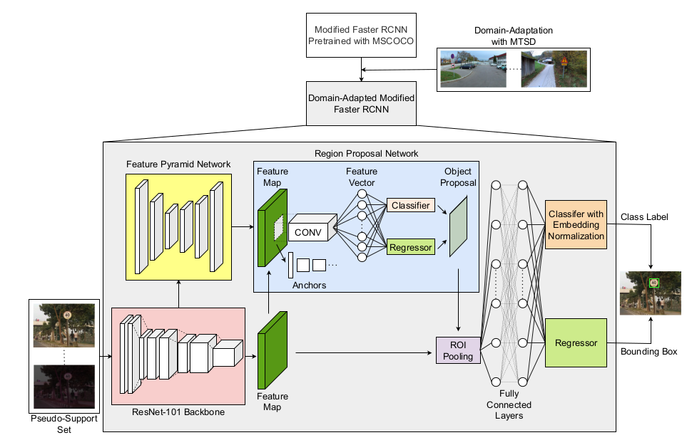
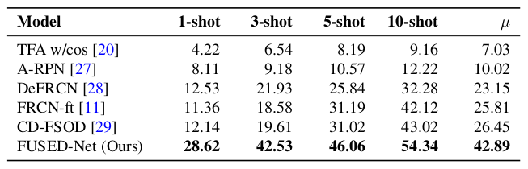
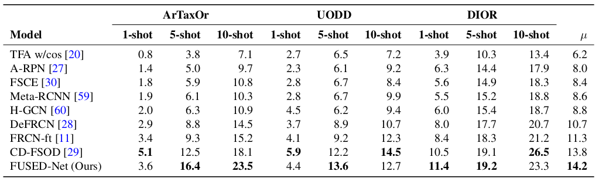

# FUSED-Net
FUSED-Net is a traffic sign detection model based on **F**aster R-CNN, designed to achieve high performance with limited data. Unlike conventional methods, FUSED-Net leverages:
- **U**nfrozen Parameters - Keeping the whole architecture unfrozen to allow learning from limited samples.
- **P**seudo-Support Set - Leveraging most used augmentation technique to extend the standard support set for few shot method.
- **E**mbedding Normalization - Incorporated to reduce intra-class variance, standardizing feature representation.
- **D**omain Adaptation - Achieved by pre-training on a diverse traffic sign dataset distinct from the target domain and improved model generalization.

You will find the overall structure of our propoposed framework in the following figure.



Following table depicts our performance in Bangladeshi Traffic Sign Dataset.



Following table depicts our performance in CD-FSOD benchmark.



Evaluating FUSED-Net on the BDTSD dataset, we achieved 2.4x, 2.2x, 1.5x, and 1.3x improvements of mAP in 1-shot, 3-shot, 5-shot, and 10-shot scenarios, respectively compared to the state-of-the-art Few-Shot Object Detection (FSOD) models. Additionally, we outperform state-of-the-art works on the cross-domain FSOD benchmark under several scenarios. 
## Installation
We used `Ubuntu 20.04.6 LTS` as our OS. Additionally, used conda to create our virtual environment. The full specification of our virtual environment is defined in `environment.yml` and you can easily download and install it by executing the following bash code in your ubuntu terminal.
```bash
git clone https://github.com/180041123-Atiq/FUSED-Net.git
cd FUSED-Net
conda env create -f environment.yml
conda activate FUSED-Net
```
## Data Processing
The present code structure requires datasets directory in the root directory of this project. And also the BDTSD dataset folder in datasets directory.
```
FUSED-Net
|-> datasets
|     |-> BDTSD.zip
|     |-> BDTSD
.
.
|-> run.sh
```
Hence, you need to create datasets directory and download the BDTSD.zip inside it and unzip it in the same place. You can do all these just by executing the following block of bash.
```bash
mkdir datasets
cd datasets
wget --no-check-certificate "https://drive.google.com/uc?export=download&id=1FRDs9V8SXFZRhyqUmMZpTiSTyLXBiCw0" -O BDTSD.zip
unzip BDTSD.zip
cd ..
```
## MTSDD Weight Initialization
Base Training a Faster-RCNN with our modification is time consuming. Thus, by executing the following block of bash you can download the weight of the base trained model (Model that is trained on MTSDD to reduce the loss of accuracy due to shift of domain).
```bash
mkdir output
cd output
wget --no-check-certificate "https://drive.google.com/uc?export=download&id=1ogF_v2QdDLPgnsCimXNpQUrv-hXHsl4m" -O model_final.pth
cd ..
```
## Training and Evaluation
Make a log directory to save the log of train and evaluation while `run.sh` has all the necessary command to fine tune and evaluate the domain adapted model on few shot BDTSD.
```bash
mkdir log
bash run.sh
```
### Citation

If you use this work, please cite:
```
Rahman MA, Asad NI, Omi MM, Hasan MB, Ahmed S, Kabir MH. FUSED-Net: Enhancing Few-Shot Traffic Sign Detection with Unfrozen Parameters, Pseudo-Support Sets, Embedding Normalization, and Domain Adaptation. arXiv preprint arXiv:2409.14852. 2024 Sep 23.
```
